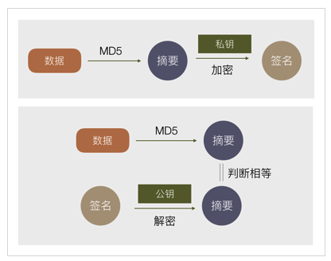
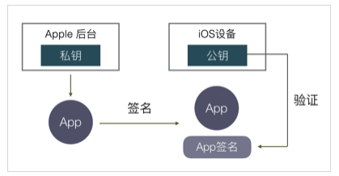
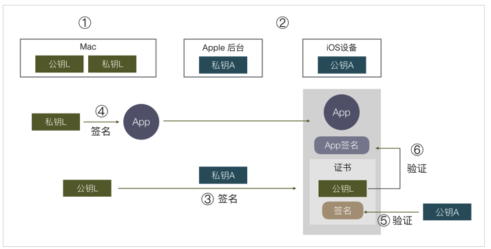
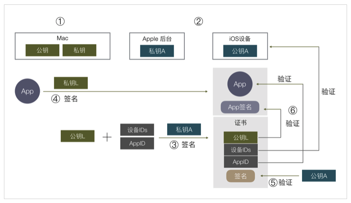

## iOS 签名原理

原文参考：http://wereadteam.github.io

iOS 签名机制比较复杂,有各种证书: provisioning profile、entitlements、 certificateSigningRequest、p12 等等，很多也容易出错，下面来梳理下。

####一、RSA 非对称加密 数学原理 剖析

- 1> 选两个质数 `p` `q`, 相乘得到一个大整数 `n`, 例如p=61,q=53,得到 n=p*q=3233.

- 2> 在1 ~ n 之间随便选择一个质数 `e`, 例如：e = 17.

- 3> 经过一系列的数学算术计算 得到一个数字 `d`。件：
    **第3步得到的数字`d` 必须满足两个条件：**
    - 1> 通过 `n` 和 `e` 这两个数据进行数学运算后，可以通过`n` 和 `d` 去反解运算， 同理反过来也可以。
    - 2> 如果只知道 `n` 和 `e` ,要推倒出`d`，需要知道 `p` 和`q`，也就是需要把 `n` 因数分解。
    
上述的`(n，e)` 这两个数据在一起就是公约，`(n ， d)` 这两个数据就是私钥， 满足公钥加密私钥解密，或者私钥加密公钥解密。
**在公钥暴露下（只知道 n  和 e ） 要推倒出（n  和 d） 需要把大整数 n 因数分解， 目前因数分解只能靠暴力穷举，而 n 数 越大，越难穷举出 因数 p  和 q ,也就越安全， 当n 大到二进制数1024位或者2048位时，以目前的技术要破解几乎不可能，因此非常的安全**

数字d的算法可以参考文章： http://www.ruanyifeng.com/blog/2013/06/rsa_algorithm_part_one.html
http://www.ruanyifeng.com/blog/2013/07/rsa_algorithm_part_two.html

####二、数字签名

数字签名的作用是我对某份数据打个标记，表示我认可这份数据（我签了名），然后我把这个签了名的数据发送给其他人，其他人可以知道这份数据是经过我本人认证过的， 数据没有被篡改

**之所以要有第一步计算摘要，是因为非对称加密的原理限制可加密的内容不能太大（不能大于上述 n 的位数，也就是一般不能大于 1024 位/ 2048 位），于是若要对任意大的数据签名，就需要改成对它的特征值签名，效果是一样的。**

####三、最简单的签名
要实现这个需求很简单，最直接的方式，苹果官方生成一对公私钥，在 iOS 里内置一个公钥，私钥由苹果后台保存，我们传 App 上 AppStore 时，苹果后台用私钥对 APP 数据进行签名，iOS 系统下载这个 APP 后，用公钥验证这个签名，若签名正确，这个 APP 肯定是由苹果后台认证的，并且没有被修改过，也就达到了苹果的需求：保证安装的每一个 APP 都是经过苹果官方允许的。

如果我们 iOS 设备安装 APP 只有从 AppStore 下载这一种方式的话，这件事就结束了，没有任何复杂的东西，只有一个数字签名，非常简单地解决问题。

但实际上因为除了从 AppStore 下载，我们还可以有三种方式安装一个 App：

- 开发 App 时可以直接把开发中的应用安装进手机进行调试。
- In-House 企业内部分发，可以直接安装企业证书签名后的 APP。
- AD-Hoc 相当于企业分发的限制版，限制安装设备数量，较少用。

苹果要对用这三种方式安装的 App 进行控制，就有了新的需求，无法像上面这样简单了。

**新的需求**

我们先来看第一个，开发时安装APP，它有两个个需求：
- 1、安装包不需要传到苹果服务器，可以直接安装到手机上。如果你编译一个 APP 到手机前要先传到苹果服务器签名，这显然是不能接受的。
- 2、苹果必须对这里的安装有控制权，包括
    - 1、经过苹果允许才可以这样安装。
    - 2、不能被滥用导致非开发app也能被安装。

为了实现这些需求，iOS 签名的复杂度也就开始增加了。

**苹果这里给出的方案是使用了双层签名，会比较绕，流程大概是这样的：**

- 1、在你的 Mac 开发机器生成一对公私钥，这里称为公钥L，私钥L。L:Local
- 2、苹果自己有固定的一对公私钥，跟上面 AppStore 例子一样，私钥在苹果后台，公钥在每个 iOS 设备上。这里称为公钥A，私钥A。A:Apple
- 3、把公钥 L 传到苹果后台，用苹果后台里的私钥 A 去签名公钥 L。得到一份数据包含了公钥 L 以及其签名，把这份数据称为证书。**（这个就是 provisioning profile）**
- 4、在开发时，编译完一个 APP 后，用本地的私钥 L 对这个 APP 进行签名，同时把第三步得到的证书**（provisioning profile）**一起打包进 APP 里，安装到手机上。
- 5、在安装时，iOS 系统取得证书，通过系统内置的公钥 A，去验证证书的数字签名是否正确。
- 6、验证证书后确保了公钥 L 是苹果认证过的，再用公钥 L 去验证 APP 的签名，这里就间接验证了这个 APP 安装行为是否经过苹果官方允许。（这里只验证安装行为，不验证APP 是否被改动，因为开发阶段 APP 内容总是不断变化的，苹果不需要管。）

**上述流程只解决了上面第一个需求，也就是需要经过苹果允许才可以安装，还未解决第二个避免被滥用的问题。怎么解决呢？苹果再加了两个限制，一是限制在苹果后台注册过的设备才可以安装，二是限制签名只能针对某一个具体的 APP。**

怎么加的？在上述第三步，苹果用私钥 A 签名我们本地公钥 L 时，实际上除了签名公钥 L，还可以加上无限多数据，这些数据都可以保证是经过苹果官方认证的，不会有被篡改的可能。

可以想到把 允许安装的设备 ID 列表 和 App对应的 AppID 等数据，都在第三步这里跟公钥L一起组成证书，再用苹果私钥 A 对这个证书签名。在最后第 5 步验证时就可以拿到设备 ID 列表，判断当前设备是否符合要求。根据数字签名的原理，只要数字签名通过验证，第 5 步这里的设备 IDs / AppID / 公钥 L 就都是经过苹果认证的，无法被修改，苹果就可以限制可安装的设备和 APP，避免滥用。

####最终流程
到这里这个证书已经变得很复杂了，有很多额外信息，实际上除了 设备 ID / AppID，还有其他信息也需要在这里用苹果签名，像这个 APP 里 iCloud / push / 后台运行 等权限苹果都想控制，苹果把这些权限开关统一称为 Entitlements，它也需要通过签名去授权。

实际上一个**“证书”**本来就有规定的格式规范，上面我们把各种额外信息塞入证书里是不合适的，于是苹果另外搞了个东西，叫 **Provisioning Profile**，一个 **Provisioning Profile** 里就包含了证书以及上述提到的所有额外信息，以及所有信息的签名。

所以整个流程稍微变一下，就变成这样了：

