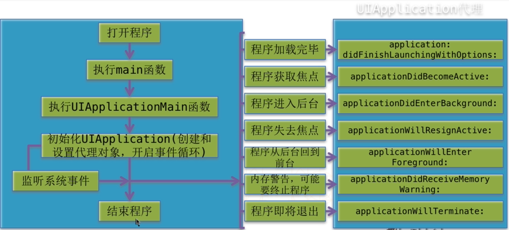

####一、应用程序启动的过程
- 1> 首先执行main 函数。
- 2> 根据main函数中的参数3和参数4提供的类名创建application和applicationDelegate
- 3> 紧接着会开启一个运行循环（主运行循环）保存程序不退出，执行各种事件处理。
- 4> 加载info.plist ，根据info.plist 中的各种配置设置程序，最主要的是查看有没有指定main.storyboard,如果有就根据
main。storyboard中指定的storyboard 显示程序。
- 5> 紧接着就 通知applicationDelegate 应用程序启动完毕， didFinishLaunchingWithOptions

####二、main 函数参数说明

```objc

int main(int argc, char * argv[]) {
    @autoreleasepool {
        
    > 参数3和参数4都是字符串类型，用于告诉系统创建appliction 用哪个类，创建appklication 的代理用哪个类
    > 参数3: UIApplication的名称或者它子类的名称，默认传nil 就相当于 传 @“UIApplication”， 这个字符串表示告诉系统用哪个类来创建应用程序。
    > 参数4: application 代理的类名
        
        return UIApplicationMain(argc, argv, nil, NSStringFromClass([AppDelegate class]));
    }
    
}

```





